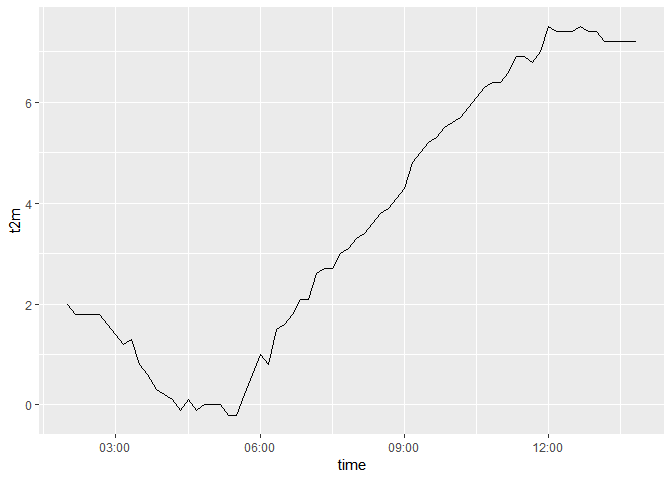

<!-- README.md is generated from README.Rmd. Please edit that file -->

# fmir

[](https://travis-ci.org/mikmart/fmir)

The `fmir` package aims to provide functions for easily accessing up to
date, open weather data, made available by the [Finnish Meteorological
Institute](https://en.ilmatieteenlaitos.fi). Key features include:

  - Use simple R syntax to create queries for the FMI API
  - Download machine readable XML weather data from the API
  - Parse the XML data to a regular data frame

FMI provides data in several different formats in their API, implemented
using OGC Web Feature Service (WFS). Currently the only format supported
by `fmir` is the “simple” format.

In order to access the download services of the FMI open data API,
you’ll need to obtain an API key by registering with the Finnish
Meteorological Institute. See [FMI’s open data
manual](https://en.ilmatieteenlaitos.fi/open-data) for details.

**Note:** `fmir` is still very early in development. Basic functionality
is available, but several issues remain: documentation is scarce, and
none of the implementation details or even function names can be
considered stable.

## Installation

At the moment, the easiest way to install `fmir` is from github with
`devtools`:

``` r
# install.packages("devtools")
devtools::install_github("mikmart/fmir")
```

## Usage

To get started, set your API key for the session first:

``` r
library(fmir)
library(ggplot2)

# set your api key for your session
fmi_set_key("insert-your-apikey-here")
```

Once your key is set, you can construct queries to the API with
`fmi_query()`and then execute the queries with `fmi_data()`:

``` r
# generate a query url with fmi_query
q <- fmi_query(place = "Oulu")

# download the data corresponding to your query
weather <- fmi_data(q)
head(weather)
#> # A tibble: 6 x 13
#>   location   time                p_sea  r_1h    rh ri_10min snow_aws   t2m
#>   <chr>      <dttm>              <dbl> <dbl> <dbl>    <dbl>    <dbl> <dbl>
#> 1 65.00639 ~ 2018-09-29 02:00:00 1012.   NaN    92      NaN      NaN   2  
#> 2 65.00639 ~ 2018-09-29 02:10:00 1012.   NaN    91      NaN      NaN   1.8
#> 3 65.00639 ~ 2018-09-29 02:20:00 1012.   NaN    90      NaN      NaN   1.8
#> 4 65.00639 ~ 2018-09-29 02:30:00 1012.   NaN    91      NaN      NaN   1.8
#> 5 65.00639 ~ 2018-09-29 02:40:00 1012.   NaN    92      NaN      NaN   1.8
#> 6 65.00639 ~ 2018-09-29 02:50:00 1012.   NaN    92      NaN      NaN   1.6
#> # ... with 5 more variables: td <dbl>, vis <dbl>, wd_10min <dbl>,
#> #   wg_10min <dbl>, ws_10min <dbl>

# draw a simple line graph of the recent temperature
ggplot(weather, aes(time, t2m)) + geom_line()
```

<!-- -->
