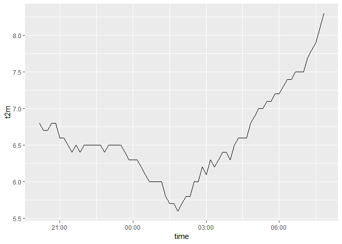

<!-- README.md is generated from README.Rmd. Please edit that file -->

# fmir

[](https://travis-ci.com/mikmart/fmir)
[](https://codecov.io/github/mikmart/fmir?branch=master)
[](https://www.tidyverse.org/lifecycle/#experimental)

**fmir** provides tools for easily accessing up to date, open weather
data from Finland. The data are made available by the [Finnish
Meteorological Institute](https://en.ilmatieteenlaitos.fi) and are
licensed under
[CC-BY 4.0](https://creativecommons.org/licenses/by/4.0/).

Key features in **fmir** include:

  - Use simple R syntax to create queries for the FMI API
  - Flexibly download XML weather data from the API
  - Parse the XML response into a regular data frame

FMI provides varying types of data in [several different
formats](https://en.ilmatieteenlaitos.fi/open-data-manual-fmi-wfs-services)
in their API, implemented using OGC Web Feature Service (WFS). Currently
the only format supported by **fmir** is the “simple” weather format. In
order to access the download services of the API, you’ll need to obtain
a key by
[registering](https://ilmatieteenlaitos.fi/rekisteroityminen-avoimen-datan-kayttajaksi)
for open data use with FMI. See [FMI’s open data
manual](https://en.ilmatieteenlaitos.fi/open-data) for details.

## Installation

At the moment, the easiest way to install **fmir** is from github with
`devtools`:

``` r
# install.packages("devtools")
devtools::install_github("mikmart/fmir")
```

## Usage

To get started, set your API key for the session with `fmi_set_key()`:

``` r
library(fmir)
library(ggplot2)

# set your api key for your session
fmi_set_key("insert-your-apikey-here")
```

Once your key is set, you can construct queries to the API with
`fmi_query()` and then execute them with `fmi_data()`. A simple query
with only a `place` parameter will return weather observations with a
10-minute interval for the past 12 hours:

``` r
# generate a query url with fmi_query
q <- fmi_query(place = c("Espoo", "Oulu", "Rovaniemi"))

# download the data corresponding to your query
weather <- fmi_data(q)
weather
#> # A tibble: 216 x 14
#>    place location  time                p_sea  r_1h    rh ri_10min snow_aws
#>    <chr> <chr>     <dttm>              <dbl> <dbl> <dbl>    <dbl>    <dbl>
#>  1 Espoo 60.17802~ 2018-09-29 20:10:00 1010  NaN      89      0.8       -1
#>  2 Espoo 60.17802~ 2018-09-29 20:20:00 1010. NaN      90      0.5       -1
#>  3 Espoo 60.17802~ 2018-09-29 20:30:00 1009. NaN      92      1.4       -1
#>  4 Espoo 60.17802~ 2018-09-29 20:40:00 1009  NaN      93      0.7       -1
#>  5 Espoo 60.17802~ 2018-09-29 20:50:00 1009. NaN      95      0.1       -1
#>  6 Espoo 60.17802~ 2018-09-29 21:00:00 1008.   1.3    96      4.2       -1
#>  7 Espoo 60.17802~ 2018-09-29 21:10:00 1008. NaN      97      3.2       -1
#>  8 Espoo 60.17802~ 2018-09-29 21:20:00 1008. NaN      96      1         -1
#>  9 Espoo 60.17802~ 2018-09-29 21:30:00 1008. NaN      97      0.4       -1
#> 10 Espoo 60.17802~ 2018-09-29 21:40:00 1007. NaN      95      0         -1
#> # ... with 206 more rows, and 6 more variables: t2m <dbl>, td <dbl>,
#> #   vis <dbl>, wd_10min <dbl>, wg_10min <dbl>, ws_10min <dbl>

# draw a simple line graph of the recent temperature
ggplot(weather, aes(time, t2m)) + geom_line(aes(colour = place))
```

<!-- -->
