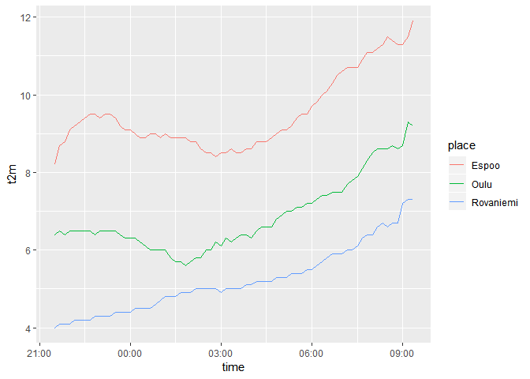

<!-- README.md is generated from README.Rmd. Please edit that file -->

# fmir

[](https://travis-ci.com/mikmart/fmir)
[](https://codecov.io/github/mikmart/fmir?branch=master)
[](https://www.tidyverse.org/lifecycle/#experimental)

**fmir** provides simple tools for easily accessing up to date, open
weather data from Finland. The data are made available by the [Finnish
Meteorological Institute](https://en.ilmatieteenlaitos.fi) and are
licensed under
[CC-BY 4.0](https://creativecommons.org/licenses/by/4.0/). See [FMI’s
open data manual](https://en.ilmatieteenlaitos.fi/open-data) for
details.

Key features in **fmir** include:

  - Use simple R syntax to create queries for the FMI API
  - Flexibly download XML weather data from the API
  - Parse the XML response into a regular data frame

FMI provides varying types of data in [several different
formats](https://en.ilmatieteenlaitos.fi/open-data-manual-fmi-wfs-services)
in their API, implemented using OGC Web Feature Service (WFS). Currently
the only format supported by **fmir** is the “simple” weather format.
For a more comprehensive and feature-rich package for accessing the FMI
API, check out <https://github.com/rOpenGov/fmi>.

## Installation

At the moment, the easiest way to install **fmir** is from github with
`devtools`:

``` r
# install.packages("devtools")
devtools::install_github("mikmart/fmir")
```

## Usage

You can construct query URLs to the API with `fmi_query()`, and then
execute them with `fmi_data()`. A simple query with only a `place`
parameter will return weather observations with a 10-minute interval for
the past 12 hours:

``` r
library(fmir)
library(ggplot2)

# generate a query url with fmi_query
q <- fmi_query(place = c("Espoo", "Oulu", "Rovaniemi"))

# download the data corresponding to your query
weather <- fmi_data(q)
weather
#> # A tibble: 216 x 14
#>    place location time                p_sea  r_1h    rh ri_10min snow_aws
#>    <chr> <chr>    <dttm>              <dbl> <dbl> <dbl>    <dbl>    <dbl>
#>  1 Espoo 60.1780~ 2019-02-09 22:40:00  995. NaN      94      0.3       39
#>  2 Espoo 60.1780~ 2019-02-09 22:50:00  995. NaN      93      0.5       39
#>  3 Espoo 60.1780~ 2019-02-09 23:00:00  995.   0.6    94      0.7       39
#>  4 Espoo 60.1780~ 2019-02-09 23:10:00  995. NaN      94      0.6       39
#>  5 Espoo 60.1780~ 2019-02-09 23:20:00  995. NaN      95      0.4       39
#>  6 Espoo 60.1780~ 2019-02-09 23:30:00  995. NaN      95      0.7       39
#>  7 Espoo 60.1780~ 2019-02-09 23:40:00  995  NaN      96      0.8       39
#>  8 Espoo 60.1780~ 2019-02-09 23:50:00  995  NaN      96      1.4       39
#>  9 Espoo 60.1780~ 2019-02-10 00:00:00  995.   0.9    97      1.6       39
#> 10 Espoo 60.1780~ 2019-02-10 00:10:00  995. NaN      97      1.2       39
#> # ... with 206 more rows, and 6 more variables: t2m <dbl>, td <dbl>,
#> #   vis <dbl>, wd_10min <dbl>, wg_10min <dbl>, ws_10min <dbl>

# draw a simple line graph of the recent temperature
ggplot(weather, aes(time, t2m)) + geom_line(aes(colour = place))
```

<!-- -->

## In the wild

For a real use-case, check out Pasi Haapakorva’s [blog
post](https://haapakorva.fi/2018/09/26/2018-09-26-keskil%C3%A4mp%C3%B6tilan-muutos-kuukausittain-oulussa-1955-2018/)
(in Finnish) looking at the trend in monthly average temperatures in
Oulu in 1955–2018. Spoiler alert: it’s been getting warmer.
